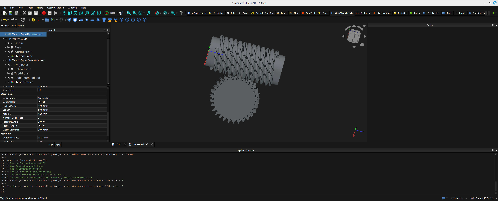

# GearWorkbench

A comprehensive FreeCAD workbench for designing all types of parametric gears.
> **NOTE**: This workbench is in heavy development, so will very likely change. Feel free to contribute, but for now, don't rely on it being consistant.
> **Note**: This workbench is separate from the built-in "Gear" workbench (freecad.gears). GearWorkbench provides extensive customization options, multiple gear types (spur, helical, rack, bevel, etc)




## Features

- **Parametric gears** with proper mathematical profiles
- **Multiple bore types**: circular, square, hexagonal, DIN 6885 keyway

## Status

**Alpha** - Many gear types are now functional: Spur gear, Internal Spur gear, Rack gear, Cycloid gear, Cycloid Rack gear, Bevel Gear, Crown Gear, Worm Gear, Globoid Worm Gear, and Double Helical Gear. Development continues on additional types and further refinements.

## Prerequisites

- FreeCAD v1.0 or higher
- Python 3.9+

## Installation

### Linux and macOS

```bash
cd ~/.local/share/FreeCAD/Mod  # or ~/.local/share/FreeCAD/v1-2/Mod
git clone https://github.com/iplayfast/GearWorkbench.git
```

### Windows

```bash
cd %APPDATA%\FreeCAD\Mod
git clone https://github.com/iplayfast/GearWorkbench.git
```

Restart FreeCAD after installation.

## Usage

### Creating a Spur Gear

1. Start FreeCAD
2. Select **GearWorkbench** from the Workbench dropdown menu
3. Click the **Create Spur Gear** icon in the toolbar
4. A parametric spur gear will be created with default values
5. Adjust the values to create the perfect gear for your needs
6. delete the parameters. Your gear is now locked, (other then normal freecad operations).
   


### Parameters

#### Core Gear Parameters

| Parameter | Description | Range | Default |
|-----------|-------------|-------|---------|
| **Module** | Tooth size (mm). Larger module = larger teeth | 0.3 - 75 mm | 2.0 mm |
| **Number of Teeth** | Total teeth on gear | 6 - 150 | 20 |
| **Pressure Angle** | Tooth profile angle (normally 20° or 25°) | 1° - 35° | 20° |
| **Profile Shift** | Moves cutter to prevent undercutting | -1 to +1 | 0 |
| **Height** | Gear thickness/length | > 0 mm | 10 mm |

#### Bore Parameters

| Parameter | Description | Options |
|-----------|-------------|---------|
| **Bore Type** | Center hole style | none, circular, square, hexagonal, keyway |
| **Bore Diameter** | Diameter of center hole | > 0 mm |
| **Square Corner Radius** | Corner rounding for square bore | > 0 mm |
| **Hex Corner Radius** | Corner rounding for hex bore | > 0 mm |
| **Keyway Width** | Width of DIN 6885 keyway | > 0 mm |
| **Keyway Depth** | Depth of keyway from bore surface | > 0 mm |

#### Read-Only Calculated Values

- **Pitch Diameter**: Where gears mesh (= module × teeth)
- **Base Diameter**: Involute origin circle
- **Outer Diameter**: Tip of teeth
- **Root Diameter**: Bottom of teeth

### Understanding Key Concepts

#### Module

The module determines tooth size:
- **Pitch diameter** = Module × Number of teeth
- **Tooth height** ≈ 2.25 × Module
- Larger module = stronger teeth, bigger gear
- For 3D printing: 1-3mm modules work well

#### Pressure Angle

Standard pressure angles:
- **14.5°**: Older standard, smoother operation
- **20°**: Modern ISO standard, stronger teeth
- **25°**: Higher strength, used for small gears

#### Profile Shift

Adjusts tooth position to:
- **Positive shift** (+): Prevents undercutting on small gears, increases strength
- **Negative shift** (-): Allows closer center distances (use with caution)
- **Zero shift** (0): Standard configuration

**Undercut Warning**: Gears with < 17 teeth at 20° pressure angle may show undercut warning. Use positive profile shift to correct.

### Creating Mating Gears

To create two gears that mesh:

1. Create first gear with desired module and pressure angle
2. Create second gear with **same module** and **same pressure angle**
3. Can have different tooth counts for desired gear ratio
4. **Center distance** = (teeth1 + teeth2) × module / 2

Example - 2:1 ratio:
- Gear 1: 20 teeth, module 2mm, PA 20°
- Gear 2: 40 teeth, module 2mm, PA 20°
- Center distance: (20 + 40) × 2 / 2 = 60mm

### 3D Printing Tips

1. **Module selection**: 1.5-3mm works well for most desktop printers
2. **Minimum teeth**: Use ≥ 12 teeth to avoid weak tooth bases
3. **Layer orientation**: Print gears flat for strongest teeth
4. **Clearance**: 0.1-0.2mm clearance between meshing gears
5. **Support material**: Usually not needed if printed flat
6. **Infill**: 50-100% for functional gears

## Development

### Running Tests

```bash
cd GearWorkbench
pip install -r requirements-dev.txt
pytest tests/ -v
```

### Code Quality

```bash
# Format code
black gearMath.py spurGear.py InitGui.py

# Lint
flake8 .
pylint gearMath.py spurGear.py

# Type check
mypy gearMath.py --ignore-missing-imports
```

## Mathematical Background

The workbench implements proper involute gear mathematics:

- **Involute curve**: Generated by unwrapping a string from the base circle
- **Base circle**: db = d × cos(pressure_angle)
- **Tooth thickness**: Adjusted by profile shift
- **Undercut detection**: Validates minimum teeth for given pressure angle

For detailed mathematics, see the source code documentation in `gearMath.py` and `CLAUDE.md`.

## Future Plans

- ✅ Spur gears
- ⬜ Helical gears (with helix angle)
- ⬜ Rack (linear gear)
- ⬜ Internal gears (ring gears)
- ⬜ Bevel gears (90° drive)
- ✅ Double helical/herringbone
- ✅ Worm gears
- ✅ Globoid Worm Gear
- ⬜ Internal Helical Gear
- ⬜ Hypoid Gear
- ⬜ Screw Gear
- ⬜ Non-Circular Gear
- ⬜ Gear train analysis
- ⬜ Strength calculations

## Related Projects

This workbench complements the existing [CycloidGearBox](https://github.com/iplayfast/CycloidGearBox) workbench, which creates cycloidal drives (different from involute gears).

## License

LGPL-2.1 - See [LICENSE](LICENSE) file

## Contributing

Contributions welcome! Please see [CONTRIBUTING.md](docs/CONTRIBUTING.md) (if exists) or open an issue.

## Feedback

Please open an issue in this repository's issue queue for bugs, feature requests, or questions.

## Credits

Based on involute gear mathematics from:
- Dudley's Handbook of Practical Gear Design
- ISO 53:1998 (Cylindrical gears for general engineering)
- [STLGears.com](https://www.stlgears.com/) for parameter ranges and UI inspiration

## Acknowledgments

Special thanks to the FreeCAD community and the freecad Gears workbench project for the foundational design patterns.
