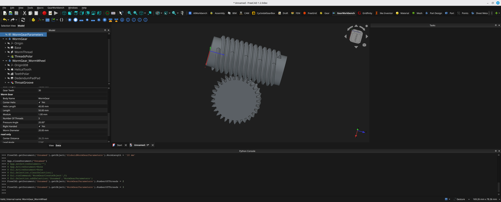

# GearWorkbench

A FreeCAD workbench for designing parametric gears. Every gear is fully parametric — change any value and the 3D model rebuilds automatically.

> **Alpha**: Actively developed. APIs and file formats may change.




## What's implemented

**Gear types**
- Spur, helical, and herringbone (unified in `genericGear.py`)
- Internal (ring) gear
- Rack gear
- Bevel gear
- Crown gear
- Worm gear and globoid worm gear
- Hypoid gear
- Screw gear
- Non-circular gear
- Cycloid gear and cycloid rack
- Geneva wheel (Maltese cross intermittent mechanism)

**Gear systems**
- Planetary gear set (sun + planets + ring, auto-calculated)
- Cycloidal gearbox

**Tools**
- **Position Gears** — select two gear bodies, dialog places them at the correct center distance with orbit angle and phase controls
- **Gear Stack** — stack multiple gears on a shared shaft

## How the code is organized

Each gear type follows the same pattern:

1. **`gearMath.py`** — all the involute math, tooth profile generation, and parameter validation. No FreeCAD dependency; easy to test standalone.
2. **`genericGear.py` / `bevelGear.py` / etc.** — FreeCAD FeaturePython objects. Each creates a `VarSet` (FreeCAD's parametric property container) and a `PartDesign::Body` built from sketches and pads/pockets.
3. **`InitGui.py`** — registers commands and builds the toolbar/menu.

The VarSet holds the parameters. A watcher object observes property changes and triggers a deferred rebuild so rapid slider drags don't queue redundant rebuilds.

```
VarSet (parameters) → watcher → FeaturePython.execute() → PartDesign::Body
```

Bores (circular, square, hex, DIN 6885 keyway) are handled in `util.py` and shared across all gear types.

## Installation

```bash
# Linux / macOS
cd ~/.local/share/FreeCAD/Mod
git clone https://github.com/iplayfast/GearWorkbench.git

# Windows
cd %APPDATA%\FreeCAD\Mod
git clone https://github.com/iplayfast/GearWorkbench.git
```

Requires FreeCAD 1.0+ and Python 3.9+. Restart FreeCAD after cloning.

## Quick start

1. Open FreeCAD and select **GearWorkbench** from the workbench dropdown.
2. Click any gear icon to create it with default parameters.
3. Expand the gear in the model tree and edit the VarSet properties — the model rebuilds live.
4. To mesh two gears: create both with the **same module and pressure angle**, select both bodies, then click **Position Gears**.

## The math

Gears use the standard involute profile. Key relationships:

| Value | Formula |
|---|---|
| Pitch diameter | `module × teeth` |
| Base circle | `pitch_diameter × cos(pressure_angle)` |
| Addendum | `1.0 × module` |
| Dedendum | `1.25 × module` |
| Center distance (external) | `(pd₁ + pd₂) / 2` |

Profile shift (`x`) moves the cutter radially — positive shift prevents undercutting on gears with fewer than ~17 teeth at 20° pressure angle. The tooth thickness and involute start point are adjusted accordingly.

The involute curve is parameterized as:
```
x(t) = r_base × (cos(t) + t×sin(t))
y(t) = r_base × (sin(t) − t×cos(t))
```

See `gearMath.py` for the full implementation including undercut detection, helical transverse-to-normal conversion, and bevel cone geometry.

## License

LGPL-2.1 — see [LICENSE](LICENSE)
